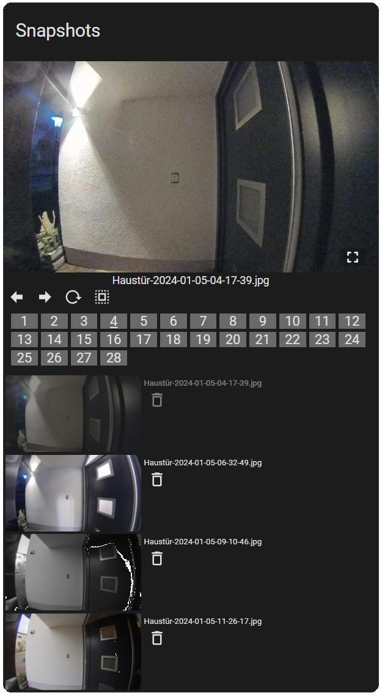
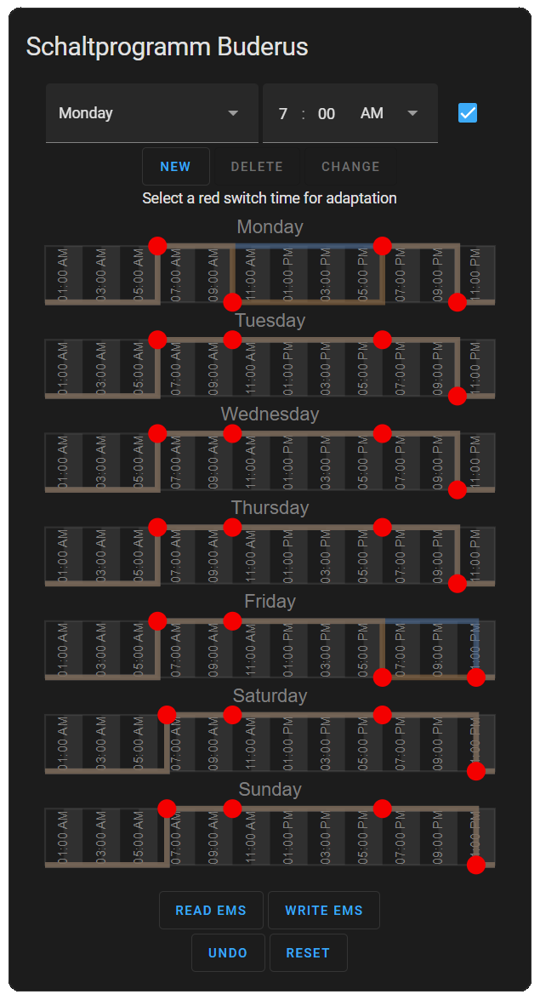

# Custom Components for Home Assistant

This repository contains some custom components for [Home Assistant](https://www.home-assistant.io/).

## Blueprints

### TuYa TS0215A remote device

Blueprint for defining actions for all four buttons of the TuYa TS0215A remote device.
The devise is integrated and tested with the [Zigbee2MQTT](https://www.zigbee2mqtt.io/) integration.

[](https://my.home-assistant.io/redirect/blueprint_import/?blueprint_url=https%3A%2F%2Fraw.githubusercontent.com%2Fheidrich76%2Fhome_assistant_custom%2Fmain%2Fblueprints%2Fautomation%2Ftuya_ts0215a_remote.yaml)

### Bitron Video AV2010/23 remote device

Blueprint for defining actions for all four buttons of the Bitron Video AV2010/23 remote device.
The devise is integrated and tested with the [Zigbee2MQTT](https://www.zigbee2mqtt.io/) integration.

[](https://my.home-assistant.io/redirect/blueprint_import/?blueprint_url=https%3A%2F%2Fraw.githubusercontent.com%2Fheidrich76%2Fhome_assistant_custom%2Fmain%2Fblueprints%2Fautomation%2Fbitron_av201023_remote.yaml)

## Custom Cards

### Simple Gallery Card

This custom card shows the photos and videos stored in a media folder in a card. You may specify how many items are shown per page and may navigate through the pages. It was inspired by https://github.com/TarheelGrad1998/gallery-card. If https://github.com/chomupashchuk/delete-file-home-assistant is installed, you may also select files and delete them (be careful :-)).

HACS is not supported yet. For manual installation do the following: 
- Download the [card](https://raw.githubusercontent.com/heidrich76/home_assistant_custom/main/www/simple-gallery-card.js).
- Copy the card into a folder named `www` as part of your config folder (see [Home Assistant's Developers Help](https://developers.home-assistant.io/docs/frontend/custom-ui/custom-card/)).
- Add the card to your [dashboard resources](http://homeassistant.local:8123/config/lovelace/resources) as a JavaScript-Modul. The path to the card is `/local/simple-gallery-card.js?v1`.
- Increase version count if you update the card!

Here is a screenshot:



There is currently also no graphical editor. So you have to add and configure the card via yaml.

Example:

```yaml
type: custom:simple-gallery-card
media_content_id: media-source://media_source/local/snapshots/
title: Snapshots
page_size: 4
```

### EMS Program Card

This custom card is able to change an EMS switch time program communicating with an EMS-ESP device via Home Assistant. Check https://github.com/emsesp/EMS-ESP32 for more details on how to obtain the device and the software:

> EMS-ESP is an open-source firmware for the Espressif ESP32 microcontroller that communicates with EMS (Energy Management System) based equipment from manufacturers like Bosch, Buderus, Nefit, Junkers, Worcester and Sieger. It requires a small gateway circuit to interface with the EMS bus which can be purchased from https://bbqkees-electronics.nl or custom built.

You may:
- Read the EMS bus for retrieving the switch times of a program (accessed via a corresponding EMS-ESP entity).
- Modify switch times for all week days (add, remove, change times).
- Write the changed program back to the EMS bus.

HACS is not supported yet. For manual installation do the following: 
- Download the [card](https://raw.githubusercontent.com/heidrich76/home_assistant_custom/main/www/ems-program-card.js).
- Copy the card into a folder named `www` as part of your config folder (see [Home Assistant's Developers Help](https://developers.home-assistant.io/docs/frontend/custom-ui/custom-card/)).
- Add the card to your [dashboard resources](http://homeassistant.local:8123/config/lovelace/resources) as a JavaScript-Modul. The path to the card is `/local/ems-program-card.js?v=1`.
- Increase version count if you update the card!

> [!WARNING] 
> Using this card, you may modify switch times of your heating system. You do this on your own risk. The card was only tested using my own heating system and was not tested with any other brands or types. I'm not liable for any issues this may cause. So, be aware that you are using the card on your own risk!

Here is a screenshot of the card:



- Switch times are red dots.
- Blue line is old program, brown is new one.
- Interface is available in English and German.

There is also a graphical editor. But, you may also add and configure the card via yaml.

Example:

```yaml
type: custom:ems-program-card
title: Switch Times Buderus Heating
entity_id: text.thermostat_hc1_switchtime1
```